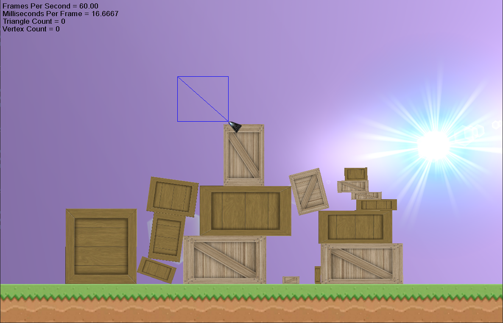

# Papageno Sandbox

A small 2D physics sandbox where you can create and place boxes of different sizes and see how they interact.
From the start the goal was to create a game where the gameplay was based on physics but when realising physics was
hard the scope was reduced to only be a demo.